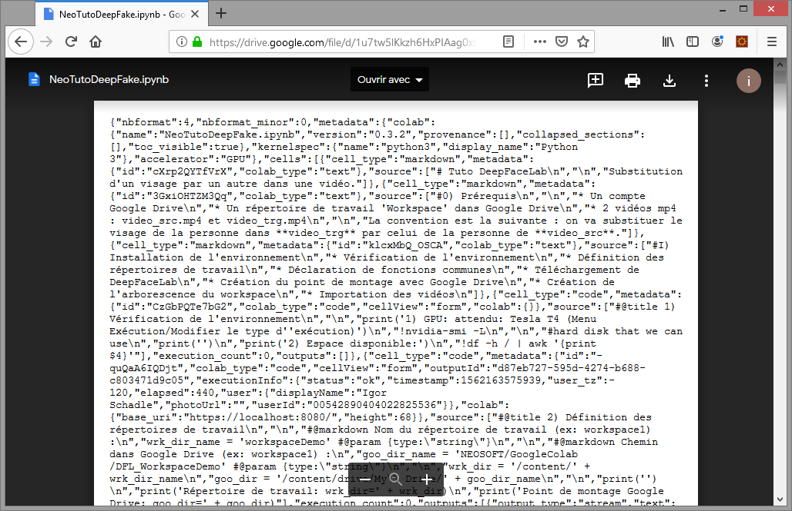
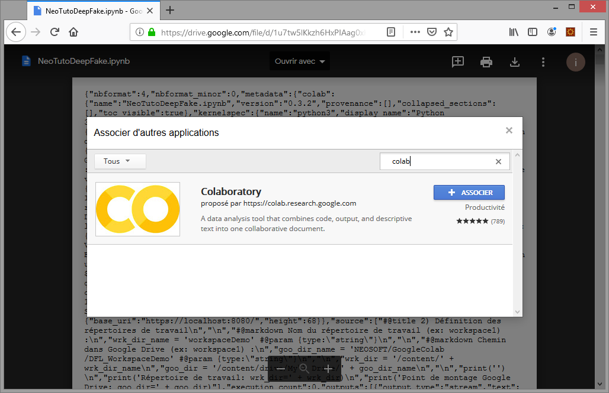
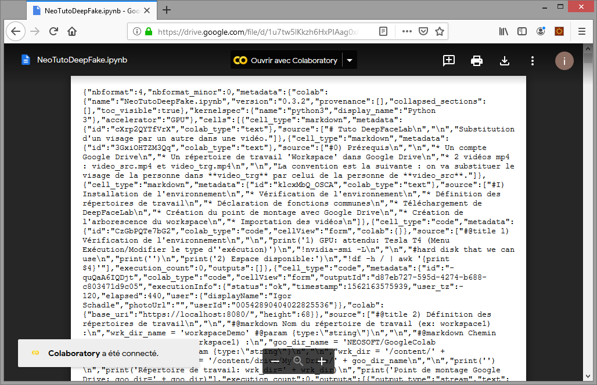
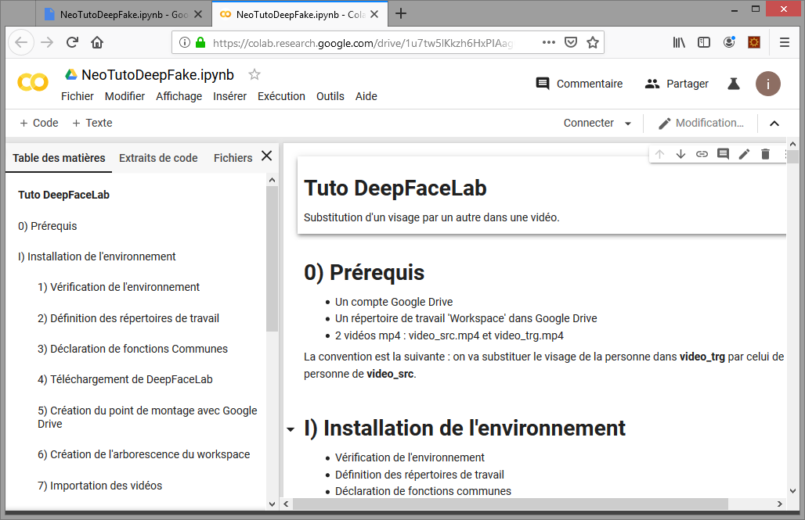

## Ouvrir un fichier ipynb dans Google Colab

Lorsque vous double-cliquez sur https://drive.google.com/open?id=1u7tw5lKkzh6HxPIAag0xKijOkISx3Ptc, vous avez : 

Cliquer sur "Ouvrir avec" / "Associer d'autres applications".
Dans la zone de recherche, taper colab :

Puis cliquer sur Associer, le menu du haut devient "Ouvrir avec Colaboratory" :

Cliquer enfin sur "Ouvrir avec Colaboratory" pour ouvrir le tuto dans Google Colab :

