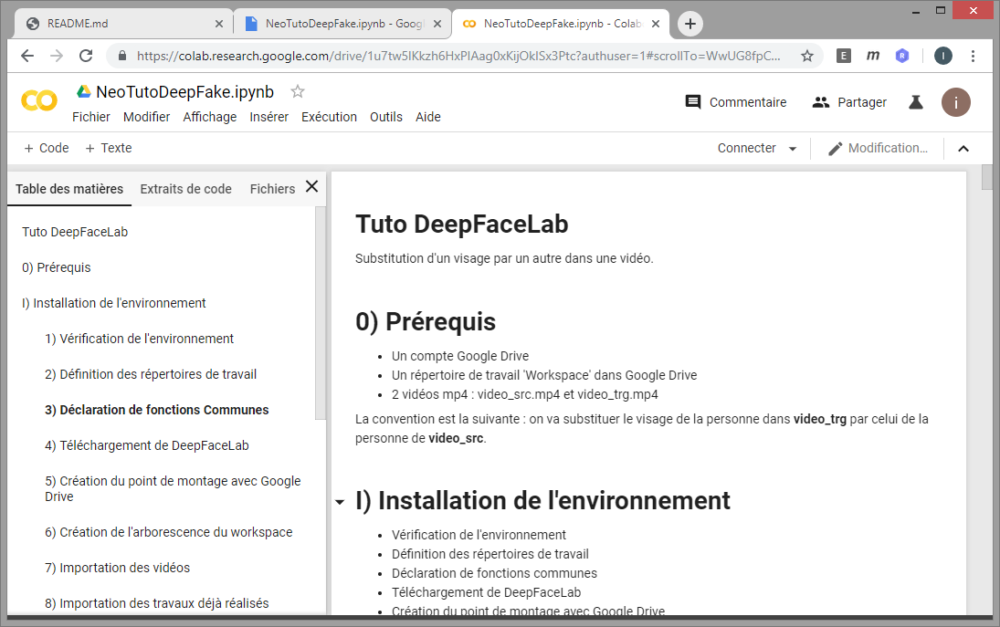

# Tuto DeepFake

Bienvenue sur le tuto DeepFake de Neo-Soft !

Dans ce tuto, nous allons voir comment changer le visage d'une personne par une autre dans une vidéo.
Si vous n'êtes pas encore au courant du DeepFake, en voici une petite illustration <a href="https://www.youtube.com/watch?v=KWdjnDIo1uo" target="_blank">https://www.youtube.com/watch?v=KWdjnDIo1uo</a>.

## Prérequis

Mais comme l'on obtient rien sans rien, ce tuto nécessite quelques prérequis :
- un compte Google Drive !
- un peu d'espace disque sur votre compte Google Drive... 2 Go
- et... un peu de temps... 30 minutes

## Lancement du tuto dans Google Colab

Cette page n'est qu'un point d'entrée, pour lancer le tuto cliquer sur le lien <a href="https://drive.google.com/open?id=1vbB4dBATo3UpIL0CwalinrLz7TDifkcP" target="_blank">https://drive.google.com/open?id=1vbB4dBATo3UpIL0CwalinrLz7TDifkcP</a> (fichier ipynb de Google Colab).

Si vous n'avez qu'un , <a href="TODO" target="_blank">une petite étape préliminaire est nécessaire</a>.

Sinon, vous n'avez plus qu'à cliquer sur  en haut de la page.

Au bout du compte vous devriez arriver sur Google Colab :

Enjoy !
